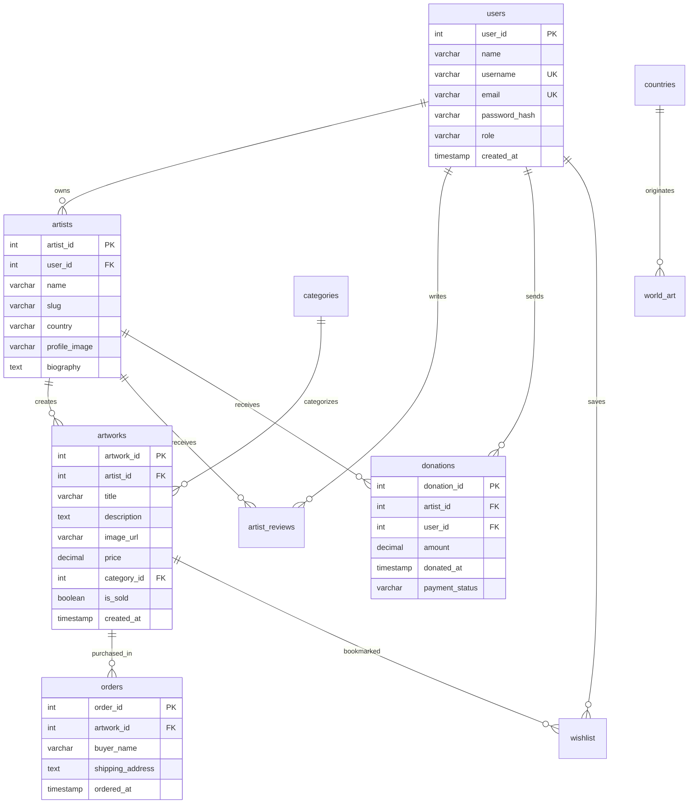

# 🏛️ Art Gallery

[](https://nextjs.org/)
[](https://react.dev/)
[](https://tailwindcss.com/)
[](https://supabase.com/)
[](LICENSE)

An immersive, high-performance digital art gallery and creator platform built with **Next.js 16 (App Router & Turbopack)**, **React 19**, **Tailwind CSS v4**, and **Supabase (PostgreSQL)**.

Designed for fluid digital exhibition, creator monetization, and art collection, Art Gallery provides interactive artist profiles, global cultural exploration, micro-donations, community reviews, unified wishlists, and an administrative management dashboard.

---

## 🌟 Key Features

* **🎨 Immersive Exhibition**: Video hero sections, dynamic artwork showcases, and category collections spanning major art movements (Renaissance, Impressionism, Surrealism, Cubism, Pop Art, Modern Art, etc.).
* **🧑‍🎨 Creator Studio (Artist Dashboard)**:
  * Portfolio management: publish and delete artworks with automatic cascade cleanup.
  * Live profile customization (biography, nationality, display name, and profile pictures).
  * Real-time donation tracking and supporter contribution history.
* **🌍 Global Collections (`/vibes` & `/world`)**:
  * Country-indexed exhibitions showcasing cultural artifacts and historical masterworks across eras.
  * Interactive slide-out panels with high-resolution image galleries.
* **💖 Unified Wishlist Engine**:
  * Live database-backed personal collection bookmarking.
  * Composite ID resolution dynamically mapping saved items across individual artworks, category multi-image sets, and global cultural artifacts.
* **☕ Artist Donations & Support**:
  * Real-time supporter contributions with quick-select tiers (₹50, ₹100, ₹500, ₹1000) or custom amounts.
  * Live aggregation of total support directly on artist profiles.
* **⭐ Collector Reviews & Ratings**:
  * 5-star rating system with real-time feedback submission.
  * Relational review author resolution from the database.
* **💳 Interactive Checkout & Order Pipeline**:
  * Simulated instant checkout modal updating artwork availability status (`is_sold`).
  * Real-time record generation in the `orders` table.
* **🛡️ Admin Command Center (`/admin`)**:
  * Aggregated platform metrics (total users, artists, artworks, donations, and reviews).
  * Tabular data management with live search across users, artworks, and customer orders.
  * Role-based user and artwork deletion with relational cascading.
* **🔐 Client-Side Cryptographic Security**:
  * Native **SHA-256 password hashing** via the browser Web Crypto API (`crypto.subtle`) ensuring plaintext passwords never leave the client.
  * Backward-compatible authentication supporting legacy accounts.

---

## 🏗️ Architecture & Tech Stack

```
                                  ┌───────────────────────────────┐
                                  │      Client Web Browser       │
                                  └───────────────┬───────────────┘
                                                  │
                                  ┌───────────────┴───────────────┐
                                  │   Next.js 16 (React 19 App)   │
                                  │  • App Router (SSG / Dynamic) │
                                  │  • Tailwind CSS v4 + Motion   │
                                  │  • Web Crypto API (SHA-256)   │
                                  └───────────────┬───────────────┘
                                                  │
                                  ┌───────────────┴───────────────┐
                                  │   Supabase Cloud Backend      │
                                  │  • PostgreSQL Database        │
                                  │  • Row-Level Security (RLS)   │
                                  │  • Storage Bucket (gallery)   │
                                  └───────────────────────────────┘
```

| Layer | Technology | Details |
|---|---|---|
| **Framework** | [Next.js 16.1.6](https://nextjs.org/) | App Router, Turbopack, SSG (`generateStaticParams`) |
| **Frontend Library** | [React 19.2.3](https://react.dev/) | Client Components, React Hooks |
| **Styling** | [Tailwind CSS v4](https://tailwindcss.com/) | PostCSS, custom fonts, glassmorphism, responsive grid |
| **Animation & UI** | Framer Motion, Swiper, React Icons | Smooth transitions, micro-interactions, modal overlays |
| **Database** | [Supabase](https://supabase.com/) | PostgreSQL, Row Level Security (RLS), Real-time queries |
| **Security** | Web Crypto API (`crypto.subtle`) | Client-side SHA-256 password digest hashing |
| **Hosting Compatibility** | Vercel & GitHub Pages | Dynamic root hosting (Vercel) & Static export (`basePath` aware) |

---

## 🗄️ Database Schema

The application utilizes a relational PostgreSQL schema hosted on Supabase:



### Tables Overview
* **`users`**: Collector, Artist, and Admin account credentials and role metadata.
* **`artists`**: Artist portfolio profiles, biographies, countries of origin, and custom slugs.
* **`artworks`**: Artwork catalog containing pricing, categorization, imagery, and sold status.
* **`categories`**: Art movements and mediums (Painting, Sculpture, Surrealism, Renaissance, etc.).
* **`countries` & `world_art`**: Global historical art indexed by continent, era, and country.
* **`donations`**: Creator micro-donation transaction log.
* **`artist_reviews`**: 1–5 star ratings and comments left by registered users.
* **`wishlist`**: Composite user bookmarks across artworks and cultural artifacts.
* **`orders`**: Checkout acquisition orders tracking buyer details and shipping information.

---

## 📁 Project Structure

```
Art_gallery/
├── app/
│   ├── (components)/
│   │   ├── layouts/
│   │   │   ├── Header.jsx         # Global navigation, dynamic auth state, responsive menu
│   │   │   └── Footer.jsx         # Footer component
│   │   ├── sections/
│   │   │   ├── One.jsx            # Video hero banner & primary CTA
│   │   │   ├── Two.jsx            # Featured artist showcase & carousel
│   │   │   ├── Three.jsx          # Movement highlights & curation
│   │   │   ├── Four.jsx           # Creator community banner
│   │   │   └── World.jsx          # Dynamic theme-toggle collection preview
│   │   ├── CheckoutModal.jsx      # Instant artwork purchase & order creation modal
│   │   ├── Donations.jsx          # Creator support donation widget
│   │   ├── PurchaseButton.jsx     # Dynamic Buy Now / Sold Out state button
│   │   ├── Review.jsx             # Star-rating and review submission component
│   │   └── Wish.jsx               # Universal bookmark wishlist button
│   ├── admin/
│   │   └── page.jsx               # Admin dashboard (users, artworks, orders, stats)
│   ├── artists/
│   │   └── [slug]/
│   │       └── page.js            # SSG dynamic artist exhibition & profile page
│   ├── auth/
│   │   └── page.jsx               # Artist Studio portal (registration & login)
│   ├── dashboard/
│   │   └── page.jsx               # Creator studio (artwork upload, profile edit, donations)
│   ├── login/
│   │   └── page.jsx               # General collector authentication (sign in & sign up)
│   ├── vibes/
│   │   └── page.jsx               # Global historical collections grouped by civilization
│   ├── wishlist/
│   │   └── page.jsx               # Personal collection manager with composite ID resolvers
│   ├── world/
│   │   └── page.jsx               # Curated categories with slide-out exhibition drawer
│   ├── layout.tsx                 # Root layout with typography and header injection
│   ├── not-found.jsx              # Custom 404 error page
│   └── page.tsx                   # Homepage composition
├── lib/
│   ├── data/                      # Static JSON datasets (artists, artworks, world art)
│   ├── supabase.js                # Supabase client configuration
│   └── utils.js                   # Dynamic asset routing & SHA-256 password hashing
├── public/                        # Static assets, videos, artwork imagery, and category photos
├── next.config.ts                 # Next.js build & deployment configuration
└── LICENSE                        # Apache 2.0 License
```

---

## 🚀 Getting Started

### 1. Prerequisites
* **Node.js**: `v18.0.0` or higher
* **npm** / **yarn** / **pnpm** / **bun**
* **Supabase Account**: A free Supabase project for database hosting

### 2. Clone the Repository
```bash
git clone https://github.com/Theroid00/Art_gallery.git
cd Art_gallery
```

### 3. Install Dependencies
```bash
npm install
```

### 4. Database Setup
1. In your [Supabase Dashboard](https://supabase.com/), open the **SQL Editor**.
2. Run the database migration script (`art_gallery.sql` and `migrate.sql`) to create all tables and relationships.
3. Configure your project credentials in `lib/supabase.js`:
   ```javascript
   import { createClient } from "@supabase/supabase-js";

   const supabaseUrl = "https://<your-project-id>.supabase.co";
   const supabaseAnonKey = "<your-anon-public-key>";

   export const supabase = createClient(supabaseUrl, supabaseAnonKey);
   ```

### 5. Run the Development Server
```bash
npm run dev
```

Open [http://localhost:3000](http://localhost:3000) in your browser to view the gallery.

### 6. Build for Production
```bash
npm run build
npm run start
```

---

## 🌐 Deployment

### Deploy to Vercel (Recommended)
1. Push your repository to GitHub.
2. Import the repository into [Vercel](https://vercel.com/new).
3. Framework Preset will be automatically detected as **Next.js**.
4. Click **Deploy**. Vercel will build and host the application at your custom root domain.

### Deploy to GitHub Pages (Static Hosting)
For static hosting on GitHub Pages:
1. In `next.config.ts`, set `output: "export"` and configure `basePath: "/Art_gallery"`.
2. Push to your deployment branch (`feature/static-export` or configure GitHub Actions workflow).

---

## 📄 License

This project is open source and licensed under the **Apache License 2.0**. See the [LICENSE](LICENSE) file for details.
